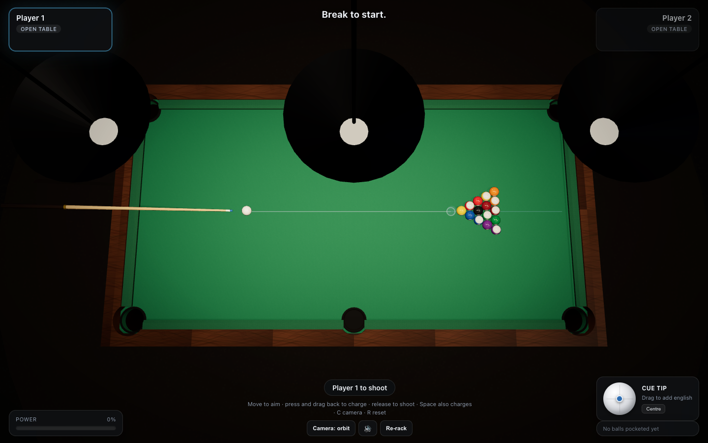

# 8-Ball — 3D Billiards

A complete 3D 8-ball pool game that runs in the browser. No build step, no
bundler, no game engine, no asset files: the table, balls, cloth, wood, cue and
every sound are generated in code, and the ball physics is a purpose-written
rigid-body simulation.



## Run it

```bash
npm start          # serves the folder on http://127.0.0.1:8099
```

Then open <http://127.0.0.1:8099>. Any static file server works — the only
requirement is HTTP rather than `file://`, because the game is written as ES
modules. three.js r160 is vendored in `vendor/`, so there is no network
dependency and nothing to install.

## How to play

| Action | Control |
| --- | --- |
| Aim | Move the mouse over the table |
| Charge a shot | Press and drag **away** from the target, then release |
| Charge with the keyboard | Hold <kbd>Space</kbd>, release to fire |
| Fine-tune the aim | <kbd>←</kbd> / <kbd>→</kbd> (hold <kbd>Shift</kbd> for micro-adjust) |
| Add english (spin) | Drag the cue-ball widget in the bottom-right panel |
| Orbit the camera | Right-drag · scroll to zoom |
| Cycle camera | <kbd>C</kbd> — orbit → overhead → follow-the-cue-ball |
| Mute / re-rack | <kbd>M</kbd> / <kbd>R</kbd> |
| Ball in hand | After a foul, click any legal spot on the cloth |

The white line shows where the cue ball is going, the ring is the ghost-ball
contact point, and the thin blue line is where the object ball will head.

The cue is held at an angle that automatically steepens when the cue ball sits
close to a rail, so the shaft rises over the cushion instead of clipping through
it — the same thing a real player does when cueing off the rail.

## Rules implemented

Standard bar/BCA-flavoured 8-ball:

- **Break** — the cue ball must reach the rack and either pot a ball or drive
  four balls to a cushion, otherwise it is an illegal break (ball in hand).
- **Open table** — groups are not assigned on the break. The first legal pot
  afterwards decides who is on solids and who is on stripes.
- **Legal shot** — you must contact your own group first (or the 8 once your
  group is cleared) and either pot a ball or send one to a cushion.
- **Fouls** — no contact, wrong ball first, no rail after contact, or a scratch.
  Any foul hands your opponent ball in hand; a scratch on the break is ball in
  hand behind the head string.
- **8-ball** — potting it before clearing your group loses, potting it legally
  wins, potting it on the break re-spots it, and fouling while potting it loses.

## The physics

`src/physics.js` is a dependency-free rigid-body simulation, which is why it can
be unit-tested in plain node.

Every ball carries a linear velocity **v** and an angular velocity **ω**.
Friction acts on the contact patch rather than on the ball as a whole:

- **Sliding** — while the contact patch slips, kinetic friction (μ = 0.2)
  decelerates the ball *and* torques it, so slide turns into roll on its own.
  This is what makes draw, follow and side spin behave correctly: a ball struck
  at 0.4R above centre reaches pure roll immediately, above that it overspins
  and accelerates, below it (backspin) it slides, grabs and comes back.
- **Rolling** — once the patch stops slipping, spin is locked to velocity and
  rolling resistance (μ = 0.011) takes over. A ball rolling at 1 m/s travels
  about 2 m before stopping, which matches a real table.
- **Ball on ball** — normal impulse with restitution 0.95 plus a tangential
  friction impulse, so balls can throw each other. Energy is checked never to
  increase.
- **Cushions** — normal impulse (e = 0.74) plus a tangential impulse applied at
  the contact point, which includes the spin term, so right english genuinely
  changes the rebound angle instead of just looking nice.
- **Pockets** — a ball is only captured once its centre has crossed the cushion
  line through a pocket mouth, which is what stops a ball resting in the corner
  of the playing surface from being "potted" by accident.

The simulation runs at a fixed 1/960 s step with sub-stepping, so a hard break
(8.6 m/s) cannot tunnel through a cushion. A full break settles in about 4–7
seconds.

## Project layout

```
index.html            markup + HUD styling + import map
src/physics.js        ball/table/cushion/pocket simulation (no dependencies)
src/rules.js          8-ball rules engine (no dependencies)
src/table.js          table, cushions, rail, pockets, balls, cue, lights
src/textures.js       procedural canvas textures (cloth, wood, ball faces, env)
src/audio.js          WebAudio synthesis for every sound (no audio files)
src/main.js           renderer, camera, input, aim prediction, HUD
serve.js              zero-dependency static server
test/physics.test.mjs 29 node tests for the physics and rules
tools/verify.mjs      drives the real game in Chrome and checks what it renders
tools/cdp.mjs         small Chrome DevTools Protocol client
tools/png-stats.mjs   PNG decoder used to inspect screenshots
vendor/               three.js r160 (MIT)
```

## Verification

```bash
npm test                        # 29 physics + rules tests
node tools/verify.mjs           # end-to-end run in a real browser
```

`tools/verify.mjs` launches Chrome, loads the page, and checks it for real: no
console errors, 16 balls racked, the scene actually drawing, the cloth green and
the pockets dark (measured from an orthographic top-down render), every ball the
right colour at its exact position, a break played with synthetic mouse input,
a straight-in pot that assigns groups through the rules engine, the ball-in-hand
flow after a scratch, all three cameras and the english widget. Screenshots land
in `tools/shots/`.

Set `POOL_GL=swiftshader` to force software rendering if the GPU path is
unavailable (much slower, useful for CI).

## Notes and limits

- Balls are not simulated in the vertical axis: a ball can never hop or jump,
  and a jump shot is not possible.
- No call-shot rules, no safeties called, no three-foul rule — the rule set is
  deliberately the common bar-room one.
- Massé and swerve are approximated: side spin affects cushion and ball
  contacts, but there is no spin-induced curve while a ball is rolling.
